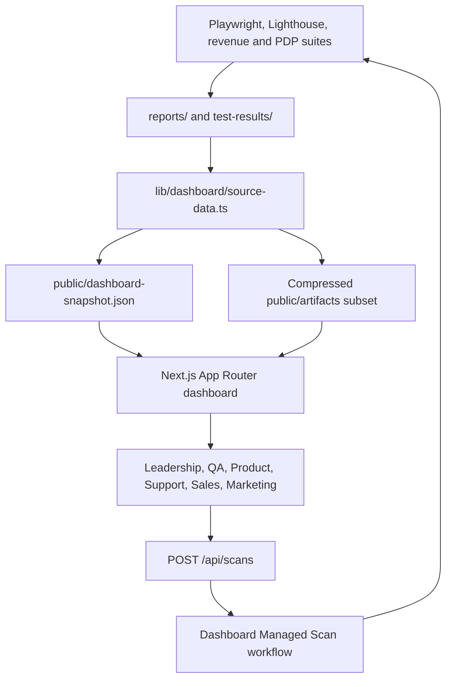

# Architecture

AI-powered website validation platform built on Playwright + TypeScript. Two execution modes share one module library:

1. **Mega-scan** (`npm run scan`) — nightly: crawls the site and runs every validator on every page, then generates dashboards.
2. **Tagged suites** (`npm run test:<suite>`) — focused, CI-friendly runs: smoke, seo, security, performance, a11y, visual.

The repository also contains a Next.js 15 executive portal. It consumes the
automation outputs without changing their test logic.

## Executive dashboard architecture



### Dashboard module map

```text
app/                         App Router pages and API routes
components/                  Executive UI, charts, gauges, tables and actions
lib/dashboard/source-data.ts Build-time report normalization
lib/dashboard/data.ts        Runtime compact snapshot/artifact reader
auth.ts                      Auth.js v5 Google OAuth and role callbacks
middleware.ts                Optional production authentication gate
scripts/prepare-dashboard-assets.ts
                             Snapshot generation and evidence compression
.github/workflows/dashboard-scan.yml
                             Long-running managed execution and redeployment
```

### Dashboard data flow

1. Existing suites write structured reports and evidence.
2. The preparation script calculates only traceable metrics from those files.
3. Screenshots are compressed and a bounded stakeholder artifact set is copied
   into `public/artifacts/`.
4. Next.js reads the compact snapshot and auto-refreshes `/api/dashboard` every
   30 seconds.
5. Run Scan dispatches the existing npm scripts through GitHub Actions because
   Playwright execution exceeds Vercel request limits.
6. The workflow regenerates reports and deploys the refreshed snapshot.

### Role model

| Role | Intended access |
| --- | --- |
| Admin | Full dashboard, execution, reports, evidence, settings |
| QA | Testing, AI RCA, reports, evidence |
| Product | Analytics and reports |
| Support | Support intelligence and evidence |
| Sales | Executive and revenue analytics |
| Marketing | Executive, SEO and reporting views |

The scan API allows only Admin and QA when authentication is enabled.

## Module map

```
src/
  config.ts                 Env-driven config: budgets, ignored paths, AI provider, devices
  types.ts                  Shared types (issues, vitals, AI analysis, trends, analytics)
  fixtures/index.ts         Playwright fixtures: sitePages, issueSink, dismissOverlays
  discovery/
    crawler.ts              BFS crawl, popup dismissal, page categorization, dedup
    pageList.ts             Suite page source — reuses website-map.json if < 24h old
  validators/               Per-page checks (ui, images, forms, links, popups, seo,
                            security, cookies, XSS probe, a11y, keyboard, responsive)
  seo/siteSeo.ts            Site-level: robots.txt, sitemap, duplicate metadata, canonicals
  performance/webVitals.ts  CWV observers (LCP/CLS/TBT) + budget enforcement
  analytics/importAnalytics.ts  GA4/GSC CSV/JSON import → traffic weights (1–10)
  ai/
    provider.ts             Pluggable LLM client (Anthropic | OpenAI | none) via fetch
    analyzer.ts             Classification, dedup signatures, prioritization,
                            release readiness, test-gap recommendations (heuristic-first)
    rootCause.ts            Per-issue rootCause/fix/businessImpact enrichment
  reports/
    siteReport.ts           Orchestrates: analytics → prioritize → dedup → AI → trend → HTML
    dashboard.ts            Advanced dashboard (heat maps, trends, AI summary, defect list)
    history.ts              Per-run trend snapshots in reports/history/
  lighthouse/               Lighthouse desktop+mobile audits
tests/
  smoke|seo|security|performance|accessibility|visual/   Tagged suites
  regression/enterprise-validation.spec.ts               Nightly mega-scan
```

## Data flow

crawl → website-map.json → validators emit `ValidationIssue[]` → analytics weights applied
→ priority = severity × traffic → dedup by signature → AI analysis (LLM if key, heuristics always)
→ trend snapshot → `reports/dashboard.html` + per-area reports + `site-report.json`.

## Key design decisions

- **Issues, not assertions, are the unit of record.** Validators return structured `ValidationIssue`s; suites assert only on severity thresholds. The dashboard stays rich even when tests pass.
- **AI degrades gracefully.** No API key → heuristic classification, dedup, prioritization and summaries still work. `AI_PROVIDER=anthropic|openai` auto-detected from keys.
- **Analytics is optional input.** Drop a GA4/Search Console CSV or JSON at `ANALYTICS_DATA_PATH`; pages with traffic get up to 10× issue priority. Absent → weight 1.
- **Flaky detection** via Playwright retries (CI: 2); pass-on-retry is reported "flaky" in the HTML/JSON reports.
- **Crawl reuse**: suites read `reports/website-map.json` when fresh to avoid re-crawling per suite.

## Tags & filtering

Suites are tagged in describe titles (`@smoke`, `@seo`, …). Filter with directories
(`playwright test tests/seo`) or `TEST_TAGS="@seo|@security" playwright test`.

## CI

- **PR** → smoke suite, chromium, 8 pages (~5 min).
- **Nightly** (02:00 UTC) → full crawl mega-scan + Lighthouse + PDF; trend history cached.
- **Weekly** (Mon 03:00 UTC) → seo/security/performance/a11y matrix at 25 pages + cross-browser smoke.
- Failure notifications via optional `SLACK_WEBHOOK` secret. Reports uploaded as artifacts.

## Enterprise scale & autonomy layers

- **Auth** (`src/auth/auth.ts`): `AUTH_MODE=form|storage|custom` — form login persists Playwright storage state reused by crawler and all suites; `loginCustom()` is the OAuth/SSO hook; crawler flags `requiresAuth` pages via login-redirect detection.
- **Scroll engine** (`src/engine/scrollEngine.ts`): mandatory full TOP→BOTTOM→TOP exploration of every page before any page-specific test. Load+network-idle → top screenshot → gradual incremental scroll down (dwelling per step so lazy images/dynamic sections/videos/widgets render) → 3–5s bottom dwell → lazy-load verification + full bottom screenshot → gradual scroll up → stabilize → final top screenshot. Records scroll depth %, total height, lazy assets, images loaded while scrolling, new/failed network requests, failed renders, dynamic-section injection, hidden-content reveals, infinite-scroll and animation issues. Every finding is classified by page position (above-fold/mid/near-footer/footer/lazy) and business section (hero/product-listing/pricing/cta/checkout/subscription), which feed the priority score. Output: `reports/page-exploration-report.html` (per-page metrics + 3 screenshots) and an exploration-coverage panel on the main dashboard. Tunable via `SCROLL_*` env vars; `SCROLL_ENGINE=0` disables.
- **Confidence layer** (`src/ai/confidence.ts`): critical/high findings are independently re-checked (re-fetch link, re-query DOM, settle-and-re-read); every issue carries a confidence %; below `CONFIDENCE_THRESHOLD` it is downgraded to info and labeled a suspected false positive.
- **Scale** (`src/discovery/crawler.ts`): `CRAWL_CONCURRENCY` parallel tabs over a shared BFS queue; seeds from homepage + sitemap(+index) + `SEED_URLS`; SHA-1 content hashes drive change detection; `INCREMENTAL=1` validates changed pages only. Rough throughput at concurrency 6: ~10 pages/min discovery, so 1000 pages ≈ 2h discovery; combine with CI sharding and incremental mode for 10k+.
- **CI**: GitHub Actions (PR/nightly/weekly), `Jenkinsfile` (parameterized profiles, HTML publish, Slack+email), `.gitlab-ci.yml` (MR smoke, scheduled full/deep matrix).

## Autonomy add-ons

- **Auth for sportstech.de** (`src/auth/auth.ts`): `AUTH_MODE=custom` runs `loginCustom()` — POSTs to `AUTH_LOGIN_ENDPOINT` (`/mm-fp/customer`) from the page context so cookies stick, verifies via logout/account markers, falls back to UI form login, and saves storage state. Establish once with `npm run auth:login` (or `:headed`); crawler + every suite reuse it. Credentials live in `.env` (gitignored).
- **Distributed queue** (`src/scale/queue.ts`): optional BullMQ path for 50k+ pages. `npm run queue:enqueue` (producer) seeds Redis; `npm run queue:work` on N nodes validates one page per job into `reports/issues/`; `npm run report:suites` aggregates. bullmq/ioredis are optionalDependencies — core build never requires them.
- **AI spec generation** (`src/ai/specGenerator.ts`): `npm run ai:generate-specs` turns analyzer `recommendedTests` + high-traffic pages into `tests/generated/*.spec.ts` stubs (tagged `@generated`, `test.fixme()` so they never gate CI until reviewed).
- **Lighthouse trends** (`src/lighthouse/trends.ts`): every `npm run lighthouse` appends category scores to `reports/history/lighthouse-scores.json` and renders `reports/lighthouse-trends.html` (Chart.js, desktop solid / mobile dashed). `lighthouserc.json` + `npm run lhci` wire the official LHCI server if you want a hosted dashboard.

## Reporting & scoring engine

- **`src/reporting/score-engine.ts`** (pure, unit-tested): `calculateSeverityCounts`, `calculateCategoryScores` (seo/accessibility/performance/security/stability/functional/visual), `calculateOverallHealthScore` (weighted blend — SEO 15%, A11y 20%, Perf 20%, Security 20%, Stability 15%, Functional 5%, Visual 5% — with a critical-issue penalty), `mostAffectedArea`, `compareWithPreviousRun` (▲/▼/→ indicators). All scores clamp to 0–100; per-category scores reuse the deduped per-page model so node-level axe inflation can't crater them.
- **`src/reporting/release-readiness.ts`**: `determineReleaseReadiness` — deterministic gate. not-ready on any critical, health<80, security<85, stability<85, a broken checkout/login/cart/subscription journey, or a homepage/PLP load failure; ready only when no critical/high and health/stability/security all ≥90; otherwise ready-with-warning. Returns an explicit `blockers[]` list shown on the dashboard.
- Wired in `src/reports/siteReport.ts`: health is now the weighted blend, the verdict comes from the deterministic gate (overriding the AI heuristic), and blockers render under the Executive Summary. Existing dashboard/history/pattern-detection (`dashboard.ts`, `history.ts`, `ai/analyzer.ts dedupeIssues`) are reused unchanged.
- Unit tests: `npm run test:unit` (node:test via tsx) cover scoring bounds, weighting, critical penalty, repeated-pattern collapse, previous-run comparison, and every release-readiness rule, with fixtures for zero/low/critical/repeated/previous-run cases.

## Revenue data integrity

- Commerce funnel percentages are observed Playwright browser/device journey
  success rates, not customer conversion rates.
- Each run is isolated under `reports/revenue-runs/<run-id>/`; aggregators read
  only that run so concurrent executions cannot contaminate results.
- AOV, sessions, actual CR, baseline revenue, and euro-loss estimates are absent
  unless a complete external dataset is explicitly connected by API, JSON, or
  environment variables.
- Automation journey-completion history is stored separately from business
  conversion history and is never used for monetary deployment correlation.

## Sharing reports (Teams / email / wiki)

- Every scan auto-generates **`reports/dashboard-shareable.html`** — a single self-contained file (inline CSS/JS, no external dependencies, ~60 KB) you can attach directly to a Teams chat or email. Recipients open it in any browser; scores, verdict, heat maps, defect list, and AI summary all render with no folder or broken links.
- `npm run report:share` regenerates it on demand. `npm run report:share:full` (or `SHARE_EMBED_SCREENSHOTS=1`) also embeds the page-exploration screenshots as base64 (larger file). `npm run report:share:zip` additionally produces `website-validation-report.zip` with all HTML reports + screenshot evidence (excludes Playwright traces/videos).

## Extending

- New validator: add `src/validators/<name>.ts` returning `ValidationIssue[]`, wire into the relevant suite and/or the regression spec.
- New page category: add a regex rule in `src/utils/url.ts`.
- New AI provider: add a `call<Provider>` function in `src/ai/provider.ts`.
