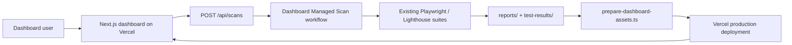

# Sportstech Quality Intelligence Deployment

The dashboard is a Next.js 15 application deployed to Vercel. Long-running browser automation does not execute inside a Vercel request. The UI dispatches the managed GitHub Actions workflow, which runs the existing suites, preserves artifacts, builds a compact dashboard snapshot, and publishes the refreshed application.

## Runtime architecture



## Requirements

- Node.js 22
- A Vercel project linked to this repository
- GitHub Actions enabled
- Google OAuth credentials when application authentication is required
- A fine-grained GitHub token for dashboard-triggered scans

## Environment variables

| Variable | Required | Purpose |
| --- | --- | --- |
| `AUTH_SECRET` | Production auth | Auth.js session signing secret |
| `AUTH_GOOGLE_ID` | When Google OAuth is enabled | Google OAuth client ID |
| `AUTH_GOOGLE_SECRET` | When Google OAuth is enabled | Google OAuth client secret |
| `DASHBOARD_AUTH_REQUIRED` | Recommended | Set `true` in production |
| `DASHBOARD_ADMIN_EMAILS` | Optional | Comma-separated administrator emails |
| `DASHBOARD_ROLE_MAP` | Optional | `email:role` mappings |
| `GITHUB_WORKFLOW_TOKEN` | Run Scan action | Fine-grained token with Actions read/write |
| `GITHUB_REPOSITORY` | Run Scan action | `owner/repository` |
| `GITHUB_WORKFLOW_REF` | Optional | Branch used for dispatch; defaults to `main` |
| `VERCEL_TOKEN` | CI deployment | Vercel deployment token |
| `VERCEL_ORG_ID` | CI deployment | Vercel team or account ID |
| `VERCEL_PROJECT_ID` | CI deployment | Linked project ID |
| `ANTHROPIC_API_KEY` | Optional | AI enrichment |
| `OPENAI_API_KEY` | Optional | AI enrichment |

Roles supported by `DASHBOARD_ROLE_MAP` are `admin`, `qa`, `product`, `support`, `sales`, and `marketing`.

## Google OAuth

1. Create a Web OAuth client in Google Cloud.
2. Add `https://<dashboard-domain>/api/auth/callback/google` as an authorized redirect URI.
3. Add `AUTH_GOOGLE_ID`, `AUTH_GOOGLE_SECRET`, and a generated `AUTH_SECRET` to Vercel.
4. Set `DASHBOARD_AUTH_REQUIRED=true`.
5. Configure admin emails or explicit role mappings.

Local development may use `DASHBOARD_AUTH_REQUIRED=false`.

## Vercel setup

```bash
npm ci
vercel link
cat .vercel/project.json
```

Copy the resulting `orgId` and `projectId` into GitHub Actions secrets as `VERCEL_ORG_ID` and `VERCEL_PROJECT_ID`. Add `VERCEL_TOKEN`.

The project build settings are repository-controlled:

- Framework: Next.js
- Install: `npm ci`
- Build: `npm run build`
- Runtime region: Frankfurt (`fra1`)

`npm run build` executes `scripts/prepare-dashboard-assets.ts` before `next build`. This produces:

- `public/dashboard-snapshot.json`
- a curated `public/artifacts/` subset containing stakeholder-facing reports and compressed evidence

The raw multi-gigabyte Playwright archive remains in GitHub Actions artifacts and is not packed into Vercel functions.

## Managed scan setup

Create a fine-grained GitHub token scoped only to this repository:

- Repository permissions → Actions: Read and write
- Repository metadata: Read

Add it to Vercel as `GITHUB_WORKFLOW_TOKEN`, along with `GITHUB_REPOSITORY`. The dashboard dispatches `.github/workflows/dashboard-scan.yml`.

Supported UI profiles:

- Full website
- PDP and add-to-cart
- Revenue protection
- Lighthouse
- SEO
- Accessibility
- Performance
- Smoke
- Regression

The payment boundary remains safe: no real order is submitted unless an explicit sandbox is configured.

## Deploy

Initial deployment:

```bash
npm ci
npm run build
vercel deploy --prod
```

For automated refreshes, use either:

- `Dashboard Managed Scan` for UI-triggered suite execution and deployment
- `Deploy Reports to Vercel` after the nightly validation artifact is available

## Domain setup

1. Vercel project → Settings → Domains.
2. Add the chosen internal dashboard domain.
3. Apply the DNS record shown by Vercel.
4. Add the final Google OAuth callback URL.
5. Enable Vercel Deployment Protection as an additional perimeter control if desired.

## Verification

```bash
npm run typecheck
npm run typecheck:dashboard
npm run test:unit
npm run build
```

Then verify:

- `/` loads KPI and chart data from the generated snapshot.
- `/api/dashboard` returns the normalized snapshot.
- `/api/artifacts/reports/executive-summary.pdf` opens.
- Run Scan returns `202` when workflow variables are configured.
- A non-QA/non-admin account receives `403` from scan execution.
- The dashboard refreshes every 30 seconds.

## Rollback

Every Vercel deployment is immutable. In Vercel → Deployments, select a prior healthy deployment and choose Promote to Production.

## Troubleshooting

| Symptom | Resolution |
| --- | --- |
| Dashboard snapshot missing | Run `npm run dashboard:prepare` or `npm run build` |
| Run Scan says orchestration is not configured | Set `GITHUB_WORKFLOW_TOKEN` and `GITHUB_REPOSITORY` |
| OAuth callback fails | Verify the exact production callback URI and `AUTH_SECRET` |
| Evidence link returns 404 | Rebuild so the curated artifact set is regenerated |
| Lighthouse shows unavailable | Run `npm run lighthouse`; the UI intentionally does not invent a score |
| Revenue euro impact is unavailable | Connect complete sessions, AOV, and actual conversion data |
